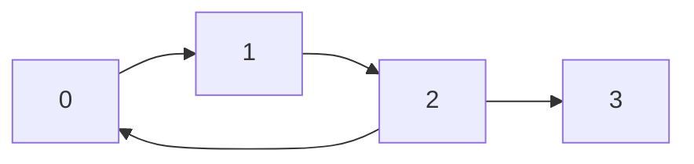

# Graphs

## What is a node?

- A node is an abstract data type with two things. 
- First, a node stores data. This data can be whatever you want - an integer, a boolean, a hash map, your own custom objects, or all of the above. 
- Second, a node stores pointers to other nodes.

## What is a graph?

- A graph is any collection of nodes and their pointers to other nodes. 
- Linked lists and trees are both types of graphs. 
- As a topic, graphs are extremely broad. There is an entire field of study dedicated to graphs called [graph theory](https://en.wikipedia.org/wiki/Graph_theory).

    

## Graphs pratical applications

- Graphs are part of our everyday lives. Without even trying too hard, you can model literally anything as a graph. Some examples of practical applications would be: 
  - Social networks like Facebook, Twitter, Instagram, and TikTok;
  - The roads in cities;
  - Circuit boards;
  - Internet network traffic;
  - Crypto blockchains;
  - Models in biology, and so much more.

## Terminology

- **Vertices**: another term for nodes.
- **Edges**: connections between the nodes.
  - **Directed edges** mean that you can only traverse in one direction: `A -> B`.
  - **Undirected edges** mean that you can traverse in both directions: `A -> B` and `B -> A`.
- **Connected component**: group of nodes that are connected by edges.
- **Node's indegree**: the number of edges that can be used to reach the node.
- **Node's outdegree**: the number of edges that can be used to leave the node.
> In binary trees, all nodes except the root had an indegree of 1 (due to their parent). All nodes have an outdegree of 0, 1, or 2. An outdegree of 0 means that it is a leaf. Specific to trees, we used the parent/child terms instead of "neighbors".
- **Neighbors**: Nodes that are connected by an edge.
- **Cyclic** means that the graph has a cycle.
- **Acyclic** means that it doesn't


## Graphical representation


- Nodes of a graph are also called vertices. 
- The pointers that connect them are called edges. 
- In graphical representations, nodes/vertices are usually represented with circles and the edges are lines/arrows that connect the circles (we saw this in the linked lists chapter).

### Directed and Undirected graphs
- Directed edges will be arrows between nodes.
- Undirected edges will just be straight lines between nodes.
    

    > In binary trees, the edges were directed. Binary trees are directed graphs. You can't access a node's parent, only its children. Once you move to a child, you can't move back.

### Connected component in a graph

- There are 2 different connected components in the following graph: {0, 1, 2} and {3, 4}.
    

    > In binary trees, there must only be one connected component (all nodes are reachable from the root).

### Cyclic and acyclic graphs


> Binary trees by definition cannot have a cycle.

### Node's indegree and outdegree

#### How to calculate Indegree of a node?


Calculate the number of arrows pointing towards the node. For e.g. for vertex `V4` there are two arrows pointing toward the node with edges as `e3` and `e4`, therefore Indegree `(V4) = 2`.

### How to calculate Outdegree of a Node?


To determine a vertex’s outdegree in a directed graph, one must count the number of directed edges that leave from that vertex.

- Outdegree `(V2) = 2` as there are two outgoing edges `e2` and `e4`.
- Outdegree `(V3) = 1` as there is only one outgoing edge `e3`.
- Outdegree `(V4) = 1` as there is only one outgoing edge `e5`.
- Outdegree `(V5) = 2` as there are two outgoing edges `e6` and `e7`.

## How are graphs given in algorithm problems?

- In linked list problems, the **head of the linked list** is given. 
- In binary tree problems, the **root of the tree** is given. 
- In graph problems, **only information about a graph** is given. There are multiple common formats that this information can come in. We will take a look at a few.
> An important thing to understand is that with linked lists and binary trees, you are literally given objects in memory that contain data and pointers. **With graphs, the graph doesn't literally exist in memory**.

> In fact, **only the "idea" of the graph exists**. The input will give you some information about it, and it's up to you to figure out how to represent and traverse the graph with code.

### First input format: array of edges

- In this input format, the input will be a 2D array. 
- Each element of the array will be in the form `[x, y]`, which indicates that there is an edge between `x` and `y`. 
- The problem may have a story for these edges - using the cities example, the story would be something like "`[x, y]` means there is a highway connecting city `x` and city `y`".
- Before starting the traversal, we can pre-process the input so that we can easily find all neighbors of any given node. Ideally, you want a data structure where you can give node as an argument and be returned a list of neighbors. **The easiest way to accomplish this is using a hash map.**
- The following graph can be represented by an array of directed edges: `edges = [[0, 1], [1, 2], [2, 0], [2, 3]]`.



#### Rust
```Rust
fn build_graph(edges: Vec<Vec<i32>>) -> HashMap<i32, Vec<i32>> {
    let mut graph: HashMap<i32, Vec<i32>> = HashMap::new();
    for edge in edges {
        let entry = graph.entry(edge[0]).or_insert(vec![]);
        entry.push(edge[1]);
    }
    graph
}
```

#### Typescript
```Typescript
function buildGraph(edges: number[][]): Map<number, number[]> {
    let graph: Map<number, number[]> = new Map()
    for (const [x, y] of edges) {
        const entry = graph.get(x) || []
        entry.push(y)
        graph.set(x, entry)
    }
    return graph
}
```

#### Python
```Python
from collections import defaultdict

def build_graph(edges):
    graph = defaultdict(list)
    for x, y in edges:
        graph[x].append(y)
    return graph
```

### Second input format: adjacency list

  ```mermaid
  graph LR
      0 --> 1
      1 --> 2
      2 --> 0
      2 --> 3
  ```

- The nodes will be numbered from `0` to `n - 1`. 
- The input will be a 2D integer array, let's call it graph - `graph[i]` will be a list of all the outgoing edges from the $i^{th}$ node.
- The graph in the image above can be represented by the adjacency list `graph = [[1], [2], [0, 3], []]`.
- Notice that with this input, we can already access all the neighbors of any given node. We don't need to do any pre-processing! This makes an adjacency list the most convenient format. If we want all the neighbors of node 6, we just check `graph[6]`.

### Third input format: adjacency matrix

<table style="width: 100%;">
<tr>
<th>Graph</th>
<th>Matrix</th>
</tr>
<tr>
<td style="text-align: center;">


</td>
<td>
<pre style="text-align: center;">
   0  1  2  3
0 [0, 1, 0, 0]
1 [0, 0, 1, 0]
2 [1, 0, 0, 1]
3 [0, 0, 0, 0]
</pre>


</td>
</tr>
</table>

- The nodes will be numbered from `0` to `n - 1`. 
- The input will be a 2D matrix of size `n x n`: graph. 
- If `graph[i][j] == 1`, that means there is an outgoing edge from node i to node j.

#### Traversing options

1. During the traversal, at any given node you can iterate over `graph[node]`, and if `graph[node][i] == 1`, then you know that node `i` is a neighbor. 
2. Build a hash map and then iterate over the entire graph. If `graph[i][j] == 1`, then put `j` in the list associated with `graph[i]`. This way, when performing the traversal, you will not need to iterate n times at every node to find the neighbors. This is especially useful when nodes have only a few neighbors and n is large.

> Both of these approaches will have a time complexity of $O(n²)$

### Fourth input format: matrix

- The input will be a 2D matrix and the problem will describe a story.
- Each square will represent something, and the squares will be connected in some way. 
- For example, "Each square of the matrix is a village. Villages trade with their neighboring villages, which are the villages directly above, to the left, to the right, or below them."
- In this case, each square `(row, col)` of the matrix is a node, and the neighbors are `(row - 1, col)`, `(row, col - 1)`, `(row + 1, col)`, `(row, col + 1)` (if in bounds).

## Code differences between graphs and trees

| Trees                                                                           | Graphs                                                                           |
| ------------------------------------------------------------------------------- | -------------------------------------------------------------------------------- |
| has a root node to start traversal from                                         | does not always have an obvious "start" point                                    |
| we are given objects for the nodes, and each node has a pointer to its children | we might need to convert the input into a hash map first                         |
| we refer to node.left and node.right at each node                               | we will need to use a for loop to iterate over the neighbors of the current node |


- Implementation of DFS for graphs is similar to implementation for trees. Doing it recursively follows the same format: check for the base case, recursively call on all neighbors, do some logic to calculate the answer, and return the answer. You can also do it iteratively using a stack.
- In any undirected graph or a directed graph with cycles, implementing DFS the same way we did with binary trees will result in an infinite cycle. 
- Like with trees, in most graph questions, we only need to (and want to) visit each node once. To prevent cycles and unnecessarily visiting a node more than once, we can use a set seen. Before we visit a node, we first check if the node is in seen. If it isn't, we add it to seen before visiting it. This allows us to only visit each node once in $O(1)$ time because adding and checking for existence in a set takes constant time.

## Graphs: DFS vs BFS

- Like with trees, in many graph problems, it doesn't really matter if you use DFS or BFS.
- There are rarely scenarios where DFS performs better than BFS - people just choose DFS because it's faster/cleaner to implement, especially recursively.
- There are some problems where using BFS is clearly better than using DFS. 
  - In trees, this was the case when we were concerned with tree levels. 
  - In graphs, it is mostly the case when you are **asked to find the shortest path**.
- BFS would visit all nodes at a depth d before visiting any node at a depth d + 1. BFS visited the nodes according to their distance from the root.
- **BFS on a graph always visits nodes according to their distance from the starting point.** This is the key idea behind BFS on graphs - every time you visit a node, you must have reached it in the minimum steps possible from wherever you started your BFS.

### DFS
#### Recursive
```Rust
fn dfs(node: usize, seen: &mut HashSet<usize>, graph: &HashMap<usize, Vec<usize>>) {
    if let Some(vec) = graph.get(&node) {
        for neighbor in vec {
            if !seen.contains(neighbor) {
                seen.insert(*neighbor);
                Self::dfs(*neighbor, seen, graph);
            }
        }
    }
}
```
#### Iterative
```Rust
fn dfs_it(node: usize, seen: &mut HashSet<usize>, graph: &HashMap<usize, Vec<usize>>) {
    let mut stack = Vec::from([node]);
    while let Some(n) = stack.pop() {
        if let Some(vec) = graph.get(&n) {
            for neighbor in vec {
                if !seen.contains(neighbor) {
                    seen.insert(*neighbor);
                    stack.push(*neighbor);
                }
            }
        }
    }
}
```

### BFS

- We implemented DFS primarily with recursion, which uses a stack under the hood. To implement BFS, we will use a **queue** (iteratively) instead.

#### Iterative
```Rust
fn bfs(grid: Vec<Vec<i32>>) -> i32 {
    if grid[0][0] == 1 {
        return -1;
    }
    let mut seen: HashSet<(usize, usize)> = HashSet::from([(0, 0)]);
    let mut q: VecDeque<(usize, usize, i32)> = VecDeque::from([(0, 0, 1)]);
    let dir: Vec<(i32, i32)> = vec![
        (0, 1), // to bottom
        (1, 0), // to right
        (1, 1), // to right and bottom
    ];
    while let Some((row, col, steps)) = q.pop_front() {
        let n = grid.len();
        if (row, col) == (n - 1, n - 1) {
            return steps;
        }
        for (dx, dy) in &dir {
            let (next_row, next_col) = ((row as i32 + dy) as usize, (col as i32 + dx) as usize);
            if grid[row][col] == 0 && !seen.contains(&(next_row, next_col)) {
                seen.insert((next_row, next_col));
                q.push_back((next_row, next_col, steps + 1));
            }
        }
    }
    -1
}
```

> With an efficient queue, BFS has the same time and space complexity as DFS.


