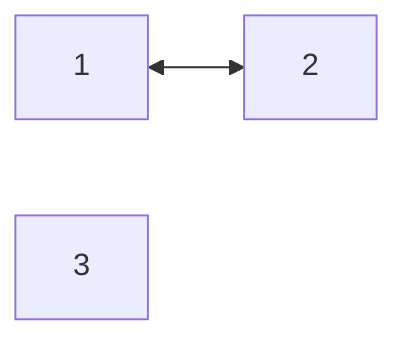
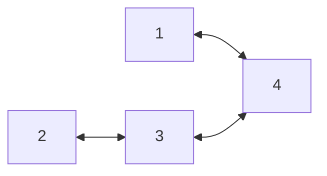

# p547_number_of_provinces
[https://leetcode.com/problems/number-of-provinces/](https://leetcode.com/problems/number-of-provinces/)

## Initial provided code
```Rust
impl Solution {
    pub fn find_circle_num(is_connected: Vec<Vec<i32>>) -> i32 {
        
    }
}
```


### Case 01
- Input: isConnected = `[[1,1,0],[1,1,0],[0,0,1]]`
- Output: 2


### Case 02
- Input: isConnected = `[[1,0,0],[0,1,0],[0,0,1]]`
- Output: 3

### Case 03
- Input: isConnected = `[[1,0,0,1],[0,1,1,0],[0,1,1,1],[1,0,1,1]]`
- Output: 1

## First approach - DFS - recursive

- n = number of nodes
- e = number of edges
- time complexity: 
  - $O(n + e)$, $e = n²$ (worst case), so $O(n²)$. 
  - Technically in this problem, the time complexity is $O(n^2)$ because the input is given as an adjacency matrix, so we always need $O(n^2)$ to build the hash map. The e is dominated by $n²$ (because $O(e < n^2)$), so it can be ignored.
- space complexity: 
  - $O(n + e)$
  - The space complexity isn't $O(n²)$ because `e` is not necessarily dominated. In the worst case scenario, $e = n²$, but `e` is still independent of `n`. In the time complexity, we always iterated over the entire matrix to build the graph, but in terms of space complexity, the hash map only grows if the edges actually exist.

## Second approach - DFS - iterative

- n = number of nodes
- e = number of edges
- time complexity: $O(n²)$
- space complexity: $O(n + e)$

  > same explanation as recursive


